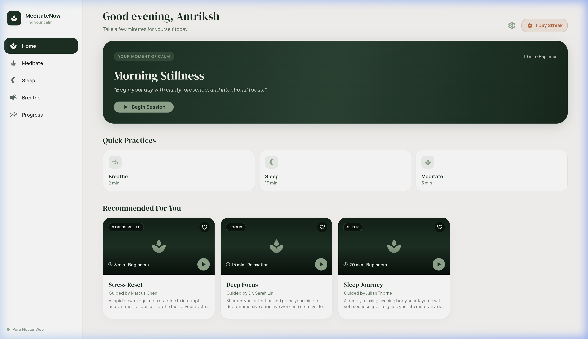
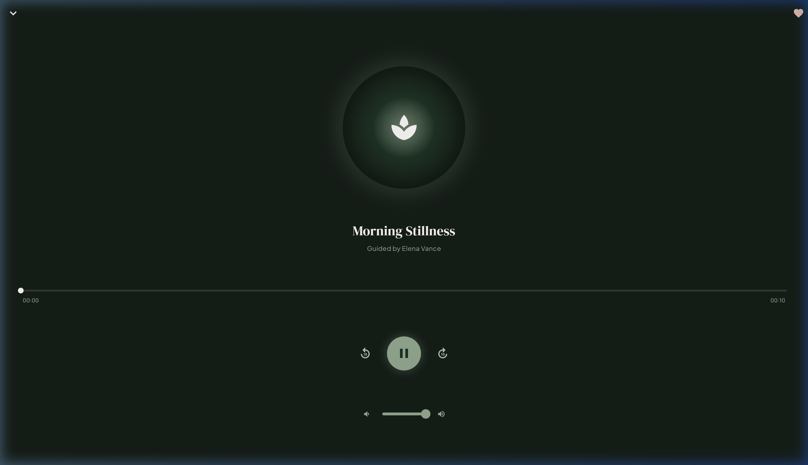
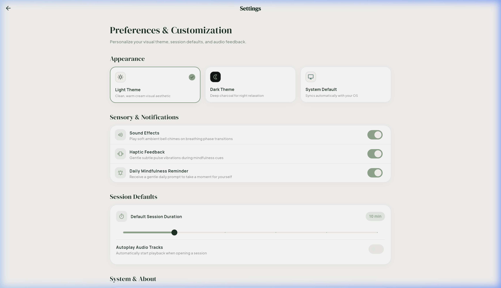
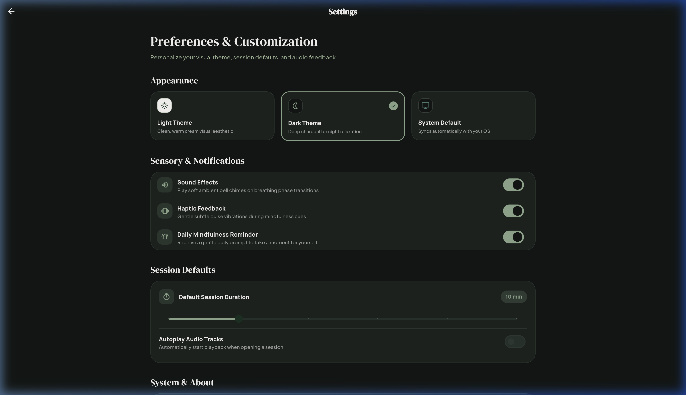
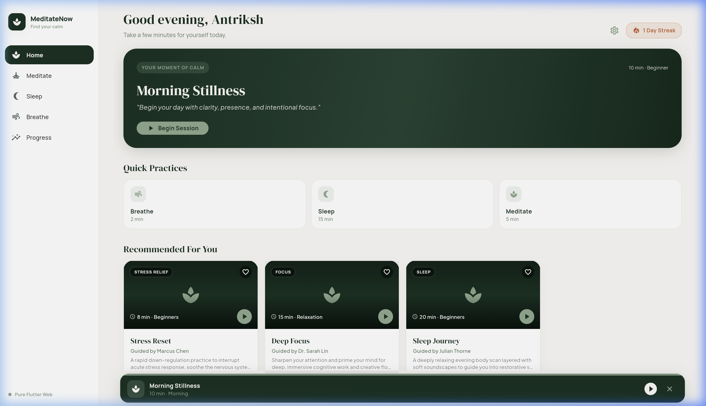

<div align="center">

  # 🧘 MeditateNow — Production-Grade Flutter Web Mindfulness Platform

  <p align="center">
    <strong>"Find your calm. Master your mind."</strong><br>
    A client-ready, responsive, cross-platform Flutter Web application built with pure Dart, Material 3 Scandinavian design aesthetics, real-time audio playback engine, interactive breathing visualizer, and persistent streak tracking.
  </p>

  <p align="center">
    
    
    
    
    
  </p>

</div>

---

## 📖 Table of Contents

- [🌟 Project Vision & Overview](#-project-vision--overview)
- [📸 Visual Showcase & Screenshots](#-visual-showcase--screenshots)
- [🔬 Core Feature Breakdown](#-core-feature-breakdown)
  - [1. 🧘 Guided Meditation Hub](#1--guided-meditation-hub)
  - [2. 🫁 Interactive Breathing Visualizer](#2--interactive-breathing-visualizer)
  - [3. 🌙 Sleep Soundscapes & Fade Timer](#3--sleep-soundscapes--fade-timer)
  - [4. 🔥 Streak Analytics & Gamified Badges](#4--streak-analytics--gamified-badges)
  - [5. 🎨 Scandinavian Material 3 Design System](#5--scandinavian-material-3-design-system)
- [⚡ Technical Architecture & Engineering Deep-Dive](#-technical-architecture--engineering-deep-dive)
  - [📁 Directory & Module Structure](#-directory--module-structure)
  - [🔊 Audio Engine & Virtual Timer Specifications](#-audio-engine--virtual-timer-specifications)
  - [💾 Persistence & State Management](#-persistence--state-management)
- [🛠️ Setup, Installation & Deployment](#️-setup-installation--deployment)
- [📄 License & Credits](#-license--credits)

---

## 🌟 Project Vision & Overview

**MeditateNow** is an all-in-one wellness platform crafted to help individuals manage stress, sharpen focus, cultivate self-compassion, and transition effortlessly into restorative sleep. 

Built strictly with **Pure Flutter & Dart** targeting **Flutter Web (Chrome)**, MeditateNow combines Scandinavian minimalism with smooth animations and responsive UX across Desktop, Tablet, and Mobile viewports.

### 🎨 Design Philosophy
- **Natural Color Palette**: Deep Forest Green (`#163022`), Soft Sage (`#8CA98E`), Warm Cream (`#FAF8F5`), and Soft Peach (`#E8A598`).
- **Typography**: Serene pairing of `GoogleFonts.dmSerifDisplay` for editorial headings and `GoogleFonts.manrope` / `GoogleFonts.plusJakartaSans` for crisp UI elements.
- **Glassmorphism & Depth**: Subtle multi-layered shadows, translucent card backdrops, and pulsing radial gradient visualizers.

---

## 📸 Visual Showcase & Screenshots

### 🏠 1. Dashboard & Personalized Recommendations
The home screen features daily inspiring quotes, quick-start session chips, active streak indicators, and curated recommendations tailored to your morning/evening rhythm.

<div align="center">
  
</div>

---

### 🎧 2. Guided Session Audio Player (10:00 Target Timer)
Full-screen audio player with pulsing radial gradient visualizer, real-time minute scrubber (`00:00` $\to$ `10:00`), play/pause, +/-10s seek, and volume slider.

<div align="center">
  
</div>

---

### 🎨 3. Responsive Light & Dark Mode Settings
Designed with high contrast accessibility — seamlessly toggle between crisp Scandinavian Light Mode and rich AMOLED Dark Mode across all responsive layout breakpoints.

| ☀️ Light Mode Theme | 🌙 Dark Mode Theme |
| :---: | :---: |
|  |  |

---

### 🎵 4. Global Mini-Player Persistence
Allows users to minimize any active session into a floating bottom bar with real-time stream progress while browsing the library, reading session details, or adjusting settings.

<div align="center">
  
</div>

---

## 🔬 Core Feature Breakdown

### 1. 🧘 Guided Meditation Hub
- **8 Curated Sessions**: Morning Stillness (10 min), Stress Reset (8 min), Deep Focus (15 min), Sleep Journey (20 min), Anxiety Release (12 min), Self Compassion (14 min), Evening Calm (15 min), and Mindful Break (5 min).
- **Category Filtering**: Filter instantly by Morning, Focus, Stress Relief, Sleep, Anxiety, Self Love, and Relaxation.
- **Session Detail View**: Explains key health benefits, difficulty level, rating, instructor bio, and session overview before launching playback.

### 2. 🫁 Interactive Breathing Visualizer
- **3 Evidence-Based Protocols**:
  - **Box Breathing (`4-4-4-4`)**: Equal 4-second Inhale, Hold, Exhale, Hold cycle used for composure and nervous system stabilization.
  - **Calm Breathing (`4-2-6-2`)**: Extended exhalation protocol to stimulate vagal tone and lower heart rate.
  - **Deep Relaxation (`4-4-8-2`)**: 4-7-8 adapted breathing for rapid sleep induction and calming racing thoughts.
- **Visual Pace Guide**: Animated breathing circle smoothly expands on Inhale, holds steady on Hold, and contracts on Exhale with step instructions.

### 3. 🌙 Sleep Soundscapes & Fade Timer
- **6 High-Definition Ambient Sounds**: Rain (summer drizzle), Ocean Waves (Pacific swells), Forest Night (canopy breeze), Soft Wind (highland air), Night Ambience (crickets & starlight), and Pink White Noise.
- **Sleep Fade Timer**: Set a 10, 20, 30, 45, or 60-minute timer. As time elapses, audio automatically stops playback to conserve battery and allow quiet sleep.

### 4. 🔥 Streak Analytics & Gamified Badges
- **Consecutive Day Tracker**: Tracks active daily meditation streaks with weekly visual calendar checks.
- **Mindful Minutes Aggregator**: Logs total minutes spent meditating and completed session counts via `SharedPreferences`.
- **Milestone Achievements**: Unlockable badges including First Session, 7 Day Calm, Early Bird, Mindful Explorer, and Deep Relaxer.

---

## ⚡ Technical Architecture & Engineering Deep-Dive

### 📁 Directory & Module Structure

```text
flutter_meditatenow/
├── docs/
│   └── screenshots/              # High-resolution application screenshots
├── assets/
│   ├── audio/                    # Ambient audio tracks (.wav & .mp3 dual-format)
│   └── images/                   # High-res nature artwork (.png)
├── lib/
│   ├── main.dart                 # Application entry point & MaterialApp theme provider
│   ├── core/
│   │   └── theme.dart            # Scandinavian color palette tokens & typography
│   ├── models/
│   │   ├── meditation_session.dart  # Guided meditation model with benefits & duration
│   │   ├── sleep_sound.dart         # Ambient sleep soundscape model
│   │   ├── breathing_exercise.dart  # Inhale / hold / exhale rhythm model
│   │   ├── user_progress.dart       # Streak, mindful minutes, session history model
│   │   └── achievement.dart         # Milestone achievement badges model
│   ├── data/
│   │   └── mock_data.dart           # Production-ready curated mock data
│   ├── services/
│   │   ├── audio_service.dart       # Singleton just_audio wrapper with virtual position stream
│   │   └── progress_service.dart    # SharedPreferences persistence layer
│   ├── screens/
│   │   ├── home_screen.dart                # Personalized dashboard & recommendations
│   │   ├── meditation_library_screen.dart  # Filterable library by category & search
│   │   ├── meditation_detail_screen.dart   # Session overview & benefit breakdown
│   │   ├── meditation_player_screen.dart   # Full-screen player with pulsing visualizer
│   │   ├── breathing_screen.dart           # Guided box breathing exercise
│   │   ├── sleep_screen.dart               # Sleep soundscapes & fade timer
│   │   ├── progress_screen.dart            # Analytics, streaks, weekly grid & badges
│   │   └── settings_screen.dart            # Responsive web settings dashboard
│   └── widgets/
│       ├── mini_player.dart         # Global floating audio mini-player
│       ├── breathing_circle.dart    # Custom animated breathing visualizer
│       └── responsive_shell.dart    # Adaptive NavigationRail / NavigationBar shell
```

---

### 🔊 Audio Engine & Virtual Timer Specifications

1. **Continuous Looping**: Guided meditation sample tracks are loaded with `LoopMode.one` so ambient audio plays continuously without stopping prematurely after 10 seconds.
2. **Virtual Session Position Stream**: A 1-second `Timer.periodic` streams virtual position (`00:00` $\to$ `10:00`) for target session durations. Scrubber dragging, play/pause, and relative seeking recalculate position cleanly.
3. **Format Resilience**: Supports dual `.wav` and `.mp3` format fallback to prevent browser MIME-type decoding errors on Chrome HTML5 Web Audio.

---

### 💾 Persistence & State Management

- **State Management**: Built using native `ChangeNotifier` and reactive `StreamBuilder` widgets, keeping the application lightweight, fast, and dependency-lean.
- **Persistence**: `ProgressService` wraps `SharedPreferences` to persist completed sessions, mindful minutes, daily streak counts, and favorite sessions locally across browser sessions.

---

## 🛠️ Setup, Installation & Deployment

### Prerequisites
- [Flutter SDK (>= 3.2.0)](https://docs.flutter.dev/get-started/install)
- Google Chrome Browser

### Step-by-Step Instructions

1. **Clone Repository**:
   ```bash
   git clone https://github.com/Antrikshh-Coder/MeditateNow.git
   cd MeditateNow
   ```

2. **Install Dependencies**:
   ```bash
   flutter pub get
   ```

3. **Run on Chrome (Development)**:
   ```bash
   flutter run -d chrome
   ```

4. **Build Production Release Bundle for Web**:
   ```bash
   flutter build web --release
   ```

---

## 📄 License & Credits

Distributed under the **MIT License**. See `LICENSE` for more details.

---

<p align="center">
  Crafted with ❤️ using <strong>Pure Flutter & Dart</strong>
</p>
